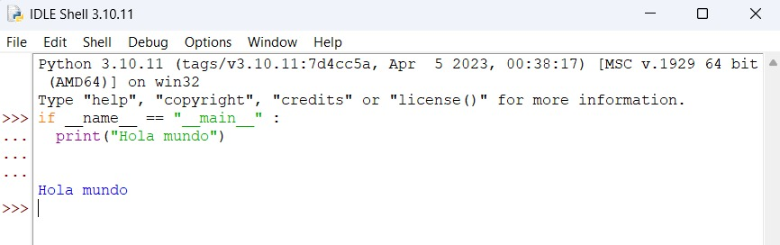
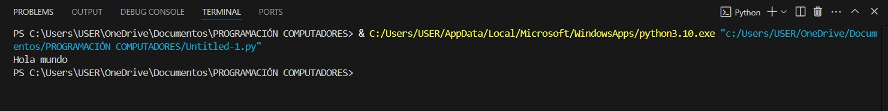
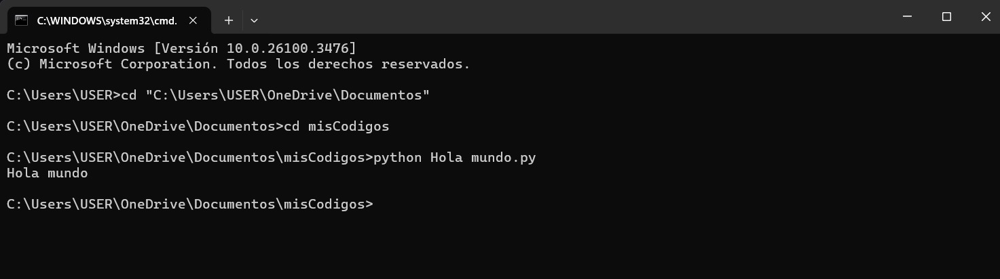

# Reto 2 -- Hola-mundo

## Sebastian Carvajal Rojas

En este repositorio observaremos como se puede codificar el siguiente código en python a través de diferentes tipos de herramientas:

if __name__ == "__main__" :
  print("Hola mundo")

1. Python

2. Visual Studio Code

3. Bloc de notas 

